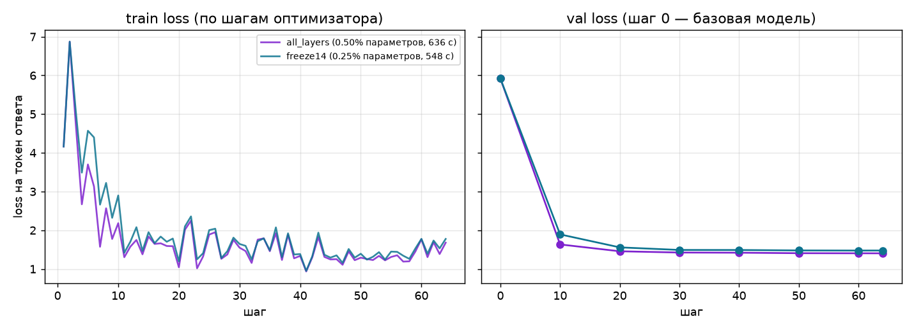

# Пять дефектов обучения

Задача — заголовок статьи по аннотации arXiv. Для сравнения слоёв использованы тензоры ДЗ 4 и Qwen3-1.7B: 512 train, 128 val, seed 42, одна эпоха, 64 шага. `tests/check.sh` не изменён: `06a02208c1f0`.

## 1. Валидация отсутствовала

Функция оценки не вызывалась: базовый loss оставался null, кривая val — пустой. Train loss не позволял сравнить адаптер с базой. Добавлена оценка до обучения, каждые 10 шагов и в конце, с усреднением по токенам ответа. Получены 8 точек: val снизился с 5,9179 до 1,4040; у freeze14 — до 1,4765.

## 2. Слишком большой learning rate

Исходный lr=0,01 делал обучение нестабильным. Уменьшен до 0,0002, scheduler и clipping сохранены. Контрольные 10 шагов с одинаковыми seed, входами и 8 примерами val: при lr=0,01 train loss достиг 34,3754, val вырос с 5,7703 до 11,1533. При lr=0,0002 конечный val — 1,5078. Полные исправленные прогоны завершились без nan/inf.

## 3. Заморозка не применялась

Аргумент `freeze_first` игнорировался: LoRA создавалась во всех блоках у обоих вариантов. Теперь `layers_to_transform` задаёт блоки 0–27 для all_layers и 14–27 для freeze14. Обучаемых параметров стало 8 716 288 против 4 358 144; матриц A/B — 392 против 196. Базовые веса заморожены в обоих случаях.

## 4. Неполная папка адаптера

Сохранялись веса и конфигурация без токенизатора и шаблона чата. Локальное сравнение скрывало зависимость от кеша, загружая токенизатор по имени модели. Добавлено его сохранение рядом с адаптером и загрузка из этой папки. Папка all_layers занимает 44,20 МиБ, матрицы — 33,30 МиБ. После копирования и независимой офлайн-загрузки все 5 ответов совпали дословно; базовые веса были отдельно кешированы.

## 5. Seed не устанавливался

`set_seed` не вызывалась: seed перемешивания не фиксировал инициализацию LoRA и dropout. Теперь random, NumPy и PyTorch инициализируются перед созданием модели. Два независимых запуска с seed=42 дали одинаковые train loss [4,1632; 6,8722; 4,7444] и конечный val 4,4713. Проверка воспроизводимости подтверждена на одном устройстве с версиями из `uv.lock`.

## Результаты двух вариантов

| Показатель | all_layers | freeze14 |
|---|---:|---:|
| Обучаемые параметры | 8 716 288 | 4 358 144 |
| Val после обучения | 1,4040 | 1,4765 |
| Чистое обучение, с | 636,4 | 548,2 |
| Валидация, с | 399,1 | 363,9 |
| Наблюдаемый максимум памяти MPS, МиБ | 6869,0 | 7393,1 |
| Матрицы LoRA, МиБ | 33,30 | 16,65 |
| Папка с токенизатором, МиБ | 44,20 | 27,55 |

Freeze14 уменьшил число параметров вдвое и время обучения на 13,9%, но наблюдаемый максимум памяти оказался выше. Train усредняется по microbatch, val — по токенам ответа. Падение val не гарантирует улучшения каждого сгенерированного заголовка; ответы показаны в [compare.md](compare.md). Все девять исходных проверок пройдены.

## Итоговый адаптер на 3072 примерах

Обучен новый all_layers на 3072 примерах с прежними 128 val и настройками: одна эпоха, 384 шага, 94 минуты 38 секунд. Конечный val улучшился с 1,4040 до 1,3691. Однако на 30 новых тестовых статьях ROUGE-L снизился с 0,3874 до 0,3679, заголовки стали ещё короче. Выбран вариант на 3072 примерах: более компактная форма заголовков предпочтительна при просмотре примеров. Улучшение точности генерации не заявляется. Сравнение all_layers и freeze14 выше проведено на одинаковых 512 примерах; freeze14 на 3072 не обучался. Новая папка также прошла офлайн-проверку: 5 ответов совпали. Результаты — в [compare.md](compare.md).
